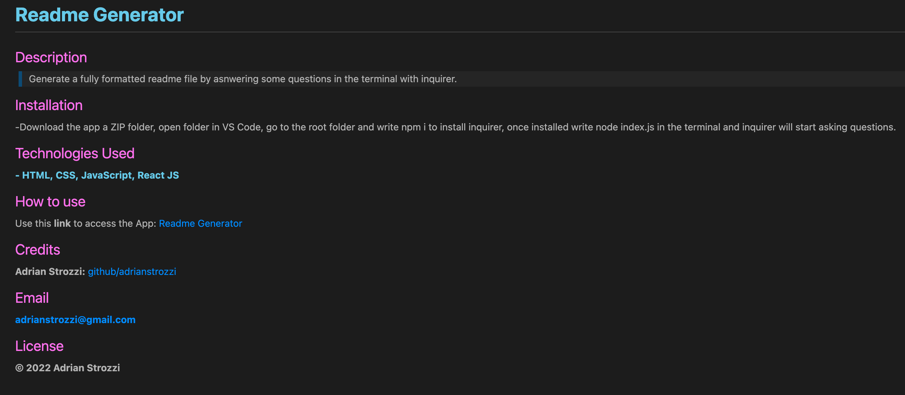
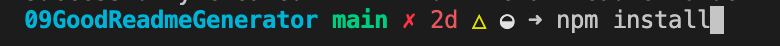
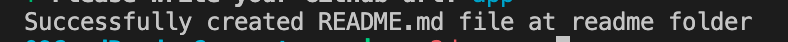
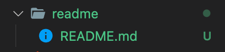

# **Adrian Strozzi - Good Readme Generator**

## Description

> Welcome to the Good Readme Generator! This app uses inquirer and Node's file system to create a README.md file. Run Node in your terminal and answer a couple of questions to generate your custom file.

## Technologies Used

**1-JavaScript**

**2-Node JS** [(link)](https://nodejs.org/en/)

**3-Inquirer JS** [(link)](https://www.npmjs.com/package//inquirer)

## Video Tutorial

Use this **link** to access a video tutorial: [Adrian Strozzi - Good Readme Generator]()

## Usage

Below is an example of a created **README.md file**:

First download this app as a **Zip file** extract it and open it in VS Code or you preferred code editor.

Go to the root folder and **install Inquirer** with npm install:

Go to the root folder and use **node index.js** to initialize the questions:

Inquirer will start a couple of **questions**, just write your answer and hit Enter when finished:

Once you answer a couple of questions you will get a **confirmation**:

Your new **README file** will be generated at the readme folder:

## Credits

**Adrian Strozzi:** [https://github.com/adrianstrozzi](https://github.com/adrianstrozzi)

## License

**© 2022 Adrian Strozzi**:zap:
